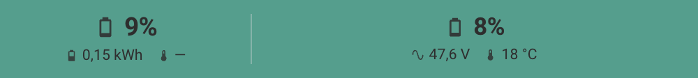

# Battery Bar

## Screenshots




Battery Bar is a compact Home Assistant Lovelace custom card that displays a summary battery state plus two individual battery columns in a fixed-height bar layout.

## Features

- Three-column layout: Summary, Battery 1, Battery 2
- Primary SoC value with compact secondary metrics
- Nested YAML configuration with `entities`, `decimals`, and `colors`
- Individually clickable values that open Home Assistant `more-info`
- Graceful handling of `unknown` and `unavailable` sensor states
- Per-metric decimal controls
- Theme-friendly styling for light and dark dashboards
- Fixed card background plus dynamic blended track color

## Installation

### HACS (Recommended)

- Add this repository via the link in Home Assistant.

[](https://my.home-assistant.io/redirect/hacs_repository/?owner=uwebaierl&repository=battery_bar&category=plugin)

- **Battery Bar** should now be available in HACS. Click `INSTALL`.
- The Lovelace resource is usually added automatically.
- Reload the Home Assistant frontend if prompted.

### HACS (manual)

1. Ensure HACS is installed.
2. Open HACS and add `https://github.com/uwebaierl/battery_bar` as a custom repository.
3. Select category `Dashboard`.
4. Search for **Battery Bar** and install it.
5. Reload resources if prompted.

If HACS does not add the resource automatically, add this Dashboard resource manually:

```yaml
url: /hacsfiles/battery_bar/battery_bar.js
type: module
```

### Manual Installation

1. Download `battery_bar.js` from the [Releases](../../releases) page.
2. Upload it to `www/community/battery_bar/` in your Home Assistant config directory.
3. Add this resource in Dashboard configuration:

```yaml
url: /local/community/battery_bar/battery_bar.js
type: module
```

## Full Example

```yaml
type: custom:battery-bar
battery_count: 2
bar_height: 56
corner_radius: 28
track_blend: 0.2
background_transparent: false
entities:
  battery_charge: sensor.battery_charge_power
  battery_discharge: sensor.battery_discharge_power
  summary_soc: sensor.battery_system_soc
  summary_energy: sensor.battery_available_energy
  summary_device_temperature: sensor.battery_device_temperature
  battery1_soc: sensor.battery_1_soc
  battery1_temp: sensor.battery_1_max_cell_temperature
  battery1_voltage: sensor.battery_1_total_voltage
  battery2_soc: sensor.battery_2_soc
  battery2_temp: sensor.battery_2_max_cell_temperature
  battery2_voltage: sensor.battery_2_total_voltage
decimals:
  soc: 0
  energy: 2
  temperature: 0
  voltage: 1
colors:
  background: "#4CAF8E"
  track: "#EAECEF"
  text: "#2E2E2E"
  battery_charge: "#4CAF8E"
  battery_discharge: "#2E8B75"
  battery_idle: "#9FA8B2"
```

## Options

| Option                     | Default           | Notes                                                                 |
| -------------------------- | ----------------- | --------------------------------------------------------------------- |
| `type`                     | required          | Must be `custom:battery-bar`                                          |
| `battery_count`            | `2`               | Set to `1` to hide the second battery section                         |
| `bar_height`               | `56`              | Clamp range `24..72`                                                  |
| `corner_radius`            | `28`              | Clamp range `0..30`                                                   |
| `track_blend`              | `0.2`             | Controls how strongly charge or discharge colors blend into the track |
| `background_transparent`   | `false`           | Transparent background when enabled                                   |
| `entities.*`               | defaults provided | Entity mapping for charge/discharge, summary, and both batteries      |
| `entities.summary_device_temperature` | default sensor | Device temperature shown next to summary energy                       |
| `decimals.soc`             | `0`               | Clamp range `0..2`                                                    |
| `decimals.energy`          | `2`               | Clamp range `0..2`                                                    |
| `decimals.temperature`     | `0`               | Clamp range `0..2`                                                    |
| `decimals.voltage`         | `1`               | Clamp range `0..2`                                                    |
| `colors.background`        | `#4CAF8E`         | Outer card background                                                 |
| `colors.track`             | `#EAECEF`         | Base track color before charge/discharge blending                     |
| `colors.text`              | `#2E2E2E`         | Text and icon color                                                   |
| `colors.battery_charge`    | `#4CAF8E`         | Charge accent blended into the track                                  |
| `colors.battery_discharge` | `#2E8B75`         | Discharge accent blended into the track                               |
| `colors.battery_idle`      | `#9FA8B2`         | Idle accent blended into the track when charge and discharge are `0`  |

Track color priority: `battery_discharge` > `battery_charge` > `battery_idle`.

## Development

Run commands from `battery_bar/`:

```bash
npm run build
npm run check:syntax
```
